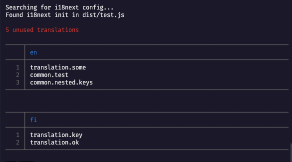

# i18next-cleanup

**Find unused i18next translations in your JavaScript/TypeScript project**

Over time, it's easy to end up with many unused translations. While unused translations don't increase you'r projects bundle size, they are unnecessary clutter you have to deal with when updating translations. 

i18-next cleaner is a CLI tool for finding those translations so you can cleanup your translation config.

## Usage

You can run `i18next-cleanup` with the following command

```shell
npx i18next-cleanup
```

It will find your i18-next configuration and read all the translation keys. Then it will try to find those translation keys in the source files of your project.

`i18next-cleanup` will display the unused translation keys after finishing the analysis.



## How it works

`i18next-cleanup` works by searching your project for the i18-next `init` call, and extracting the translation keys from the object passed to it.


## Limitations

Currently `i18next-cleanup` doesn't support translations defined outside the i18next config object in the `init` [call](https://www.i18next.com/overview/api). 